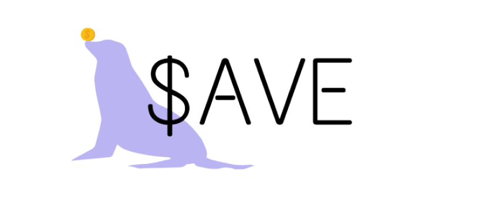
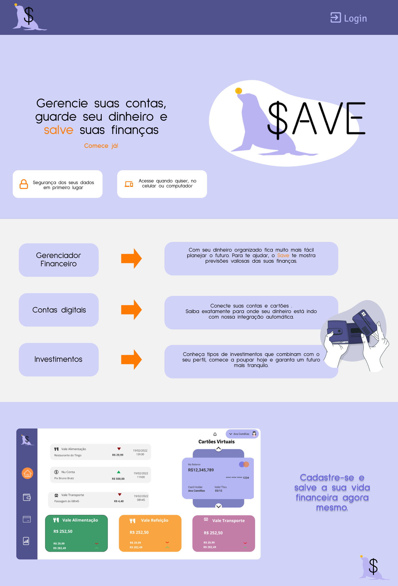
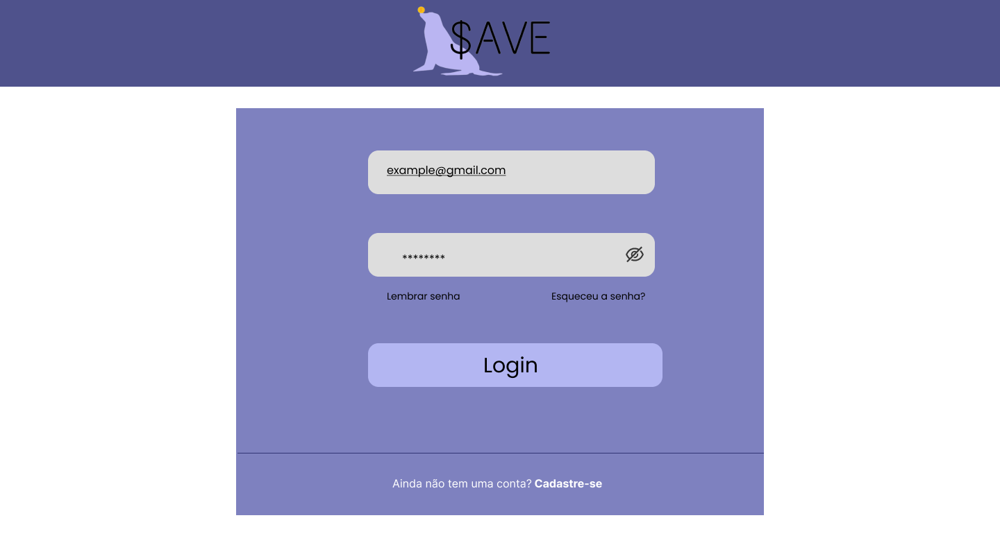
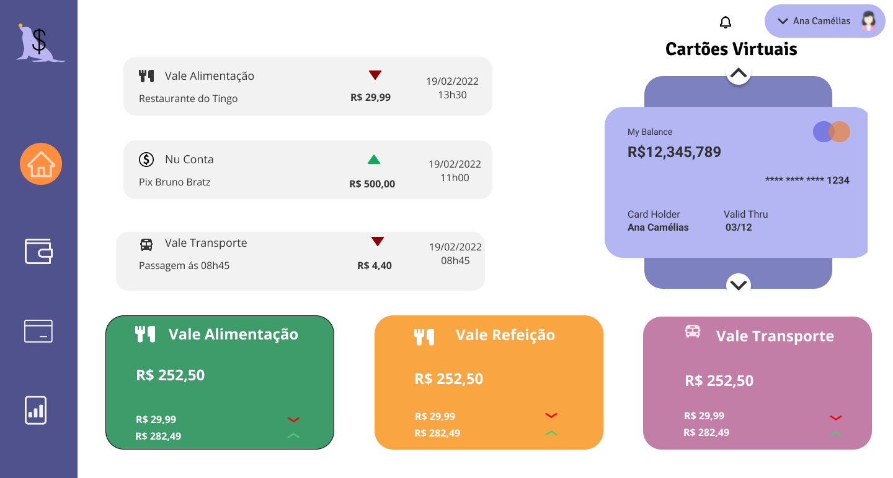
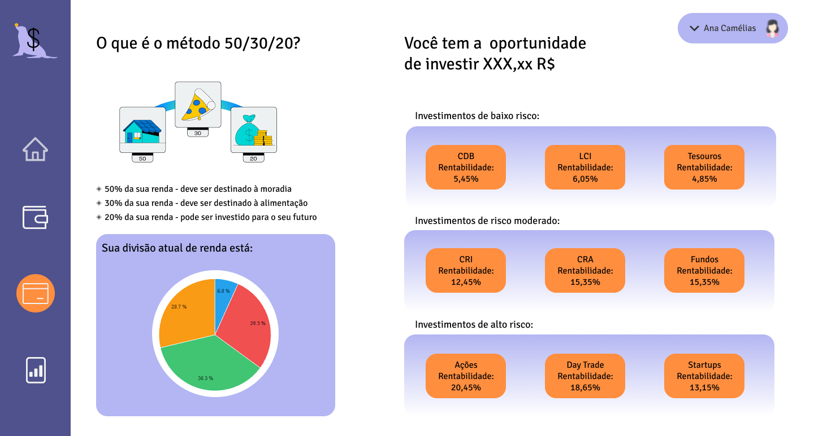
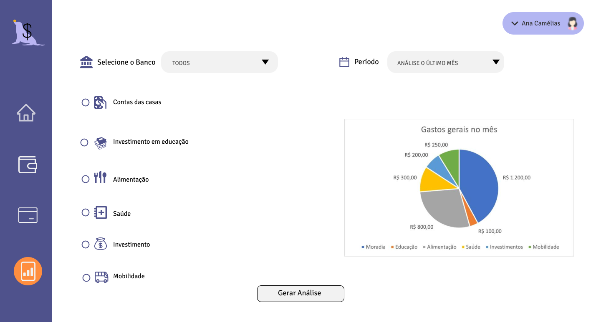
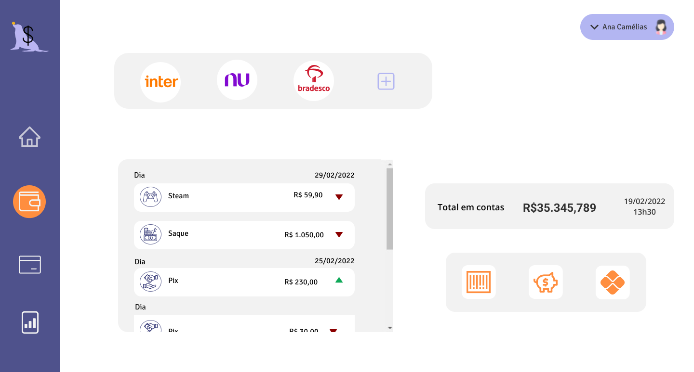

<p align="center">
    
</p>
<h1 align="center">Save</h1>

<h4 align="center"> 
	✅  Save 💰📈 Concluído  ✅
</h4>


## 💻 Sobre o Projeto
Open Finance, ou Sistema Financeiro Aberto, é o compartilhamento padronizado de dados sobre produtos, informações financeiras e serviços pelas instituições autorizadas pelo Banco Central. 

Pensando em todos os fatores que influenciam a vida financeira do brasileiro, apresentamos a aplicação do produto SAVE. Ela é uma super gerenciadora financeira que integra todas as contas de bancos, vale refeições, alimentação e transporte. O principal objetivo é processar os dados financeiros do usuário e trazer gráficos altamente intuitivos para que o mesmo possa enxergar todos os seus gastos e entender de forma simples e prática sua situação financeira.

---
## ⚙️ Funcionalidades
- [x] Os usuários tem acesso ao site por meio do computador, onde podem:
    - [x] Consultar o saldo de todos os cartões pareados.
    - [x] Ver o extrato dos cartões de acordo com o filtro selecionado.
    - [x] Mostra formas de como organizar sua vida financeira baseado no saldo que tem.
    - [x] Fazer investimentos sabendo do risco.
    - [x] Criar relatórios explicativos de acordo com o filtro selecionado.

---

## 🎨 Layout

O layout da aplicação está disponível no Figma:

<a href="https://www.figma.com/file/glVmISlSPJXR0VMUSw8nbO/Untitled?node-id=0%3A1">
  
</a>

### Web
<!-- PRINT dO SITE NO COMPUTADOR -->
<p align="center" style="display: flex; align-items: flex-start; justify-content: center;">
  
</p>
<p align="center" style="display: flex; align-items: flex-start; justify-content: center;">
  
  
  
  
  
</p>

---

## 🚀 Como executar o projeto

### Pré-requisitos

Antes de começar, você vai precisar ter instalado em sua máquina as seguintes ferramentas:
[Git](https://git-scm.com). 
Além disto é bom ter um editor para trabalhar com o código como [VSCode](https://code.visualstudio.com/)

#### 🧭 Rodando a aplicação web (Frontend)

```bash

# Clone este repositório
$ git clone https://github.com/brunosa91/Hackathon-XP--Open-finance.git

# Acesse a pasta do projeto no seu terminal/cmd
$ cd Hackathon-XP--Open-finance

# Abrir projeto no vscode
$ code .

# A aplicação será aberta na porta:3000 - acesse http://localhost:3000

```

---

## 🛠 Tecnologias

As seguintes ferramentas foram usadas na construção do projeto:

#### **Website**

-   HTML 5
-   CSS 3
-   **[JavaScript](https://www.javascript.com/)**


#### **Utilitários**

-   Protótipo:  **[Figma](https://www.figma.com/)**  →  **[Protótipo (Save)](https://www.figma.com/file/glVmISlSPJXR0VMUSw8nbO/Untitled?node-id=129%3A383)**
-   Apresentação do Projeto: **[Canva](https://www.canva.com/)** → **[Slide (Save)](https://www.canva.com/design/DAE461zakfo/S62pLCtRshOxPY8aigkkVw/view?utm_content=DAE461zakfo&utm_campaign=designshare&utm_medium=link&utm_source=sharebutton)**
-   Editor:  **[Visual Studio Code](https://code.visualstudio.com/)**
-   Markdown:  **[StackEdit](https://stackedit.io/)**,  **[Markdown Emoji](https://gist.github.com/rxaviers/7360908)**
-   Teste de API:  **[Insomnia](https://insomnia.rest/)**
-   Ícones:  **[Feather Icons](https://feathericons.com/)**,  **[Font Awesome](https://fontawesome.com/)**
-   Fontes:  **[Overpass](https://fonts.google.com/specimen/Overpass?query=overpass)**

---

## 🦸 Autores
<table>
<tr>
<td>
<a href="https://github.com/anaabalbi">
    
    <br>
    <sub><b>Ana Amélia</b></sub>
</a> 
<a href="https://github.com/anaabalbi">🙈</a>
<br>

[](https://www.linkedin.com/in/ana-am%C3%A9lia-oliveira-47590722a/) 
<!-- [](mailto:brunosantana.engenharia@gmail.com) -->

</td>
</tr>
</table>

<br>

<table>
<tr>
<td>
<a href="https://github.com/brunosa91">
    
    <br>
    <sub><b>Bruno Santana de Sá</b></sub>
</a> 
<a href="https://github.com/brunosa91">🙈</a>
<br>

[](https://www.linkedin.com/in/brunoasantanadesa/) 
[](mailto:brunosantana.engenharia@gmail.com)

</td>
</tr>
</table>

<br>

<table>
<tr>
<td>
<a href="https://github.com/LeoAChaves">
    
    <br>
    <sub><b>Leonardo Chaves</b></sub>
</a> 
<a href="https://github.com/LeoAChaves">🙈</a>
<br>

[](https://www.linkedin.com/in/leonardo-chaves-b6544b229/) 
<!-- [](mailto:brunosantana.engenharia@gmail.com) -->

</td>
</tr>
</table>

<br>

<table>
<tr>
<td>
<a href="https://github.com/alvesarah">
    
    <br>
    <sub><b>Sarah Alves</b></sub>
</a>
<a href="https://github.com/alvesarah">🦄</a>
<br>

[](https://www.linkedin.com/in/sarahalvesoliveira/) 
[](mailto:salves726@gmail.com)

</td>
</tr>
</table>

<br>

<table>
<tr>
<td>
<a href="https://github.com/vanessacreis">
    
    <br>
    <sub><b>Vanessa Reis</b></sub>
</a>
<a href="https://github.com/vanessacreis">🦄</a>
<br>

[](https://www.linkedin.com/in/vanessacreisbh/) 
<!-- [](mailto:salves726@gmail.com) -->

</td>
</tr>
</table>

<br>

---
